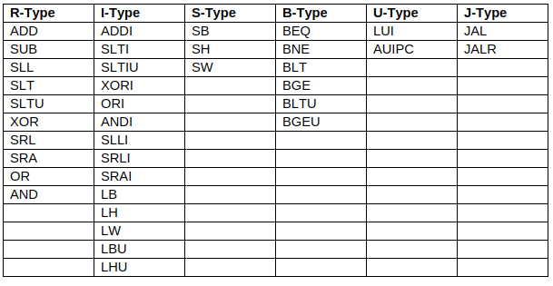

# Abstract:

Developing a Single cycle 32-bit RISC-V core to be used as a building block to implement a pipelined version. All the instructions in the RV32I base instruction set of RISC-V has been implemented except some instructions like ECALL and EBREAK(Instructions that are implemented are listed below). These missed out instructions will be implemented when hardware emulation(FPGA implemntation) of the core is carried out.

Control signals are generated using hardwired control unit using a part of 32-bit instruction as input. Two separate memories for instruction and data is used to achieve single cycle execution. The main aim of implementing single cycle before a pipelined version is because the control unit will be nearly identical in both.

## Instruction implemented from RV32I:

## Try in your machine:
The core is not extensively tested so proper execution of all combinations of multiple instructions is not gauranteed.
The default output register is register[1].

Pre-requisite: iverilog

1. Put in the 32 bit instruction in reverse order inside the instruction_mem.mem file (Template given inside)
2. Initialize the register file using register_init.mem (Template given inside)
3. run iverilog risc_testbench.v
4. Execute the binary provided by iverilog 
